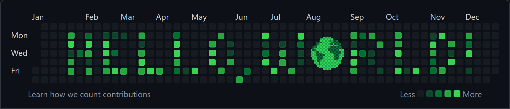

<!-- Credits to Devicon (https://devicon.dev/) for icons used throughout! -->
<link rel="stylesheet" href="https://cdn.jsdelivr.net/gh/devicons/devicon@v2.15.1/devicon.min.css">

<!-- Custom "Hello, World!" Banner (Made with Canva) -->



<!-- "Base"/HTML-related Stack: VS Code, Git, HTML, Markdown, JSON, Bash -->
<div align="center">
  
  &nbsp; &nbsp;

  
  &nbsp; &nbsp;

  
  &nbsp; &nbsp;

  
  &nbsp; &nbsp;

  
  &nbsp; &nbsp;

  
  &nbsp; &nbsp;
</div>
<br>

```html
<h2>About Me</h2>
<ul>
  <li class="bio">Enjoys building and breaking in equal measure</li>
  <li class="tech-stack">Always learning, but prefers personal projects</li>
  <li class="learning-queue">TypeScript, Vue 3, Python, Flask, MongoDB</li>
  <li class="death-to-pineapples">Despises pineapple on pizza</li>
  <!-- <li class="self-ref-humour">Feels obliged to include an About Me</li> -->
</ul>
```

<!-- "Styling"/CSS-related Stack: Draw.io, CSS, Sass, Vuetify -->
<div align="center">
  
  &nbsp; &nbsp;

  
  &nbsp; &nbsp;

  
  &nbsp; &nbsp;

  
  &nbsp; &nbsp;
</div>
<br>

```css
* {
  font-family: Helvetica Neue, Helvetica, Arial, sans-serif;
  padding: 0;
  margin: 0;
}

h2 {
  font-size: 32px;
  font-weight: bold;
}

.tech-stack {
  display: flex !important;
  justify-content: center;
  align-items: center;
  flex-wrap: wrap-reverse;
}

.learning-queue {
  list-style: disc;
}

.death-to-pineapples {
  color: yellow;
  padding: 10px;
  border: 2px groove orange !important;
  border-radius: 5px;
}
```

<!-- "Programming"/JavaScript-related Stack: C++, C#, Python, JavaScript -->
<div align="center">
  
  &nbsp; &nbsp;

  
  &nbsp; &nbsp;

  
  &nbsp; &nbsp;

  
  &nbsp; &nbsp;

  
  &nbsp; &nbsp;
</div>
<br>

```js
const sections = [
  '.bio',
  '.tech-stack',
  '.learning-queue',
  '.death-to-pineapples',
];

sections.forEach(section => {
  const sectionElement = document.querySelector(section);
  sectionElement.addEventListener('mouseover', () => {
    sectionElement.style.backgroundColor = getBackgroundColour(section);
  });
});

function getBackgroundColour(section) {
  switch (section) {
    case '.bio':
      return 'green';
    case '.tech-stack':
      return 'darkblue';
    case '.learning-queue':
      return 'purple';
    case '.death-to-pineapples':
      return 'black';
  }
}
```

<!-- Miscellaneous Stack: ??? -->
<div align="center">

</div>
<br>

<!-- Custom Contact Info Banner (Made with Canva) -->


<!-- CSS code explaining more specifics, adding "flavour" and "styling" to simple and bland HTML stuff from top
style classes from above html!!! -->
<!-- JavaScript to explain functionality (projects, future improvements, learning)-->
<!-- Chaos engineering, custom gifs, open source contributer, professional yak shaver, cloud tech  -->
<!-- 1. About me (HTML)
1. Tech stack (CSS)
2. Learning Queue (JavaScript?)
3. Contact info (github activity overview design?) -->
