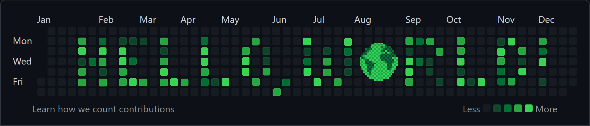

<!-- Custom "Hello, World!" Banner (Canva) -->


```html
<h1>About Me</h1>
<ul>
  <li class="bio">Enjoys building and breaking in equal measure 🦠</li>
  <li class="learning-queue">Aspires to become the HTML guru 🧠</li>
  <li class="addiction">Can't stop watching Fireship vids 🚀</li>
  <li class="new-years-resolution">Learning how to center divs 🎊</li>
  <!-- <li class="witty-meta-humour">Contractually obligated to include emojis 🫡</li> -->
</ul>
```

| HTML | CSS | Sass | JavaScript | TypeScript | Vue.js | Node.js | Express.js | Python | C/C++ | C# | Unity |
| ---- | --- | ---- | ---------- | ---------- | ------ | ------- | ---------- | ------ | ----- | -- | ----- |
|      |
<br>

<!-- Skill Icons -->
<div align="center">
  
  &nbsp; &nbsp;
  
  &nbsp; &nbsp;
  
  &nbsp; &nbsp;
  
  &nbsp; &nbsp; 
  
  &nbsp; &nbsp;
  
  &nbsp; &nbsp; 
  
  &nbsp; &nbsp; 
  
  &nbsp; &nbsp; 
  
  &nbsp; &nbsp; 
  <!-- 
  &nbsp; &nbsp;  -->
  
  &nbsp; &nbsp; 
  
  &nbsp; &nbsp; 
  
  &nbsp; &nbsp; 
</div>
